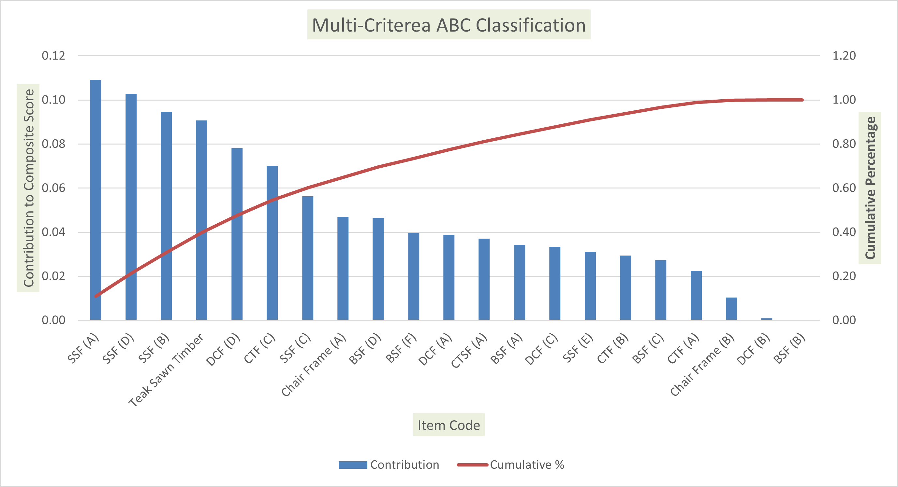
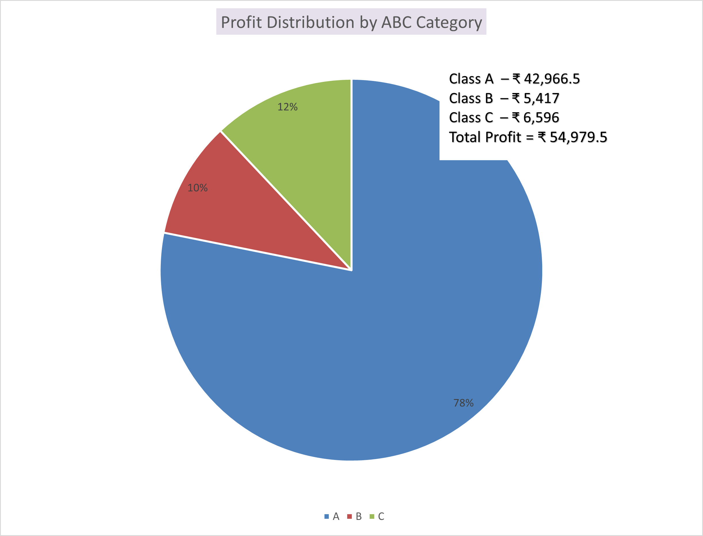
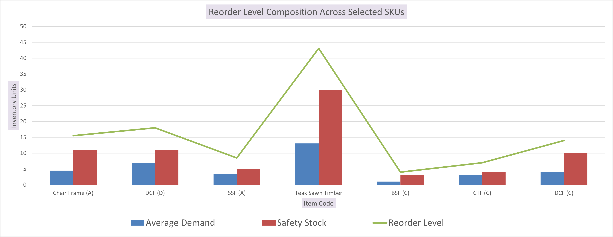

# 📦 Data-Driven Inventory Optimization using ABC & Demand Variability Analysis

### 👤 Abdul Hadi

**Roll No:** 22f1001445
**Program:** IITM BS Degree

---

## 📌 Project Overview

This project applies **data analytics and inventory optimization techniques** on real transaction data from a furniture component business.

The business deals with:

* Furniture frames (raw & polished)
* Timber (e.g., teak sawn timber)
* Structural components

Inventory decisions were previously manual, leading to inefficiencies.

---

## 🎯 Objective

To design a **data-driven inventory system** that:

* Prioritizes SKUs effectively
* Accounts for demand variability
* Optimizes safety stock
* Improves replenishment decisions

---

## ⚠️ Problem Statement

* No SKU prioritization
* High demand variability
* Excess safety stock
* Inefficient capital allocation
* No structured inventory policy

---

## 🧠 Methodology

1. Data Cleaning & Aggregation
2. Traditional ABC Analysis
3. Multi-Criteria ABC Classification
4. Demand Variability (CV)
5. Safety Stock Calculation
6. Reorder Level Optimization

---

# 📊 Visual Analysis

---

## 🔹 Multi-Criteria ABC Classification



📌 Insight:

* SKUs ranked using composite score
* Stable + profitable items prioritized
* High variability items penalized

---

## 🔹 Profit Distribution (ABC)



📌 Insight:

* Class A contributes ~78% of total profit
* Confirms Pareto principle

---

## 🔹 Reorder Level & Safety Stock



📌 Insight:

* Safety stock dominates inventory
* Demand variability drives stock levels

---

## 📈 Key Findings

* Few SKUs dominate profit
* Multi-criteria ABC improves prioritization
* 60–75% inventory is safety stock
* Variability is main driver of inefficiency

---

## 🔁 Inventory Model

```
Reorder Level = Demand during Lead Time + Safety Stock
```

Service Levels:

* Class A → Z = 1.88
* Class B → Z = 1.65
* Class C → Z = 1.28

---

## 🧠 Recommendations

* Continuous review → Class A
* Periodic review → Class B & C
* Reduce stock for declining items
* Lean inventory for stable SKUs

---

## 🏁 Conclusion

Inventory inefficiency is driven by **demand variability, not just profit concentration**, requiring a **risk-adjusted strategy**.

---

## 📁 Repository Structure

```
project-root/
│── assets/
│    └── graphs/
│         ├── multi_abc.png
│         ├── profit_distribution.png
│         └── reorder_level.png
│── data/
│── README.md
```

---

## 📌 Key Takeaway

Combining **ABC classification + demand variability analysis** leads to better inventory decisions in real-world businesses.
